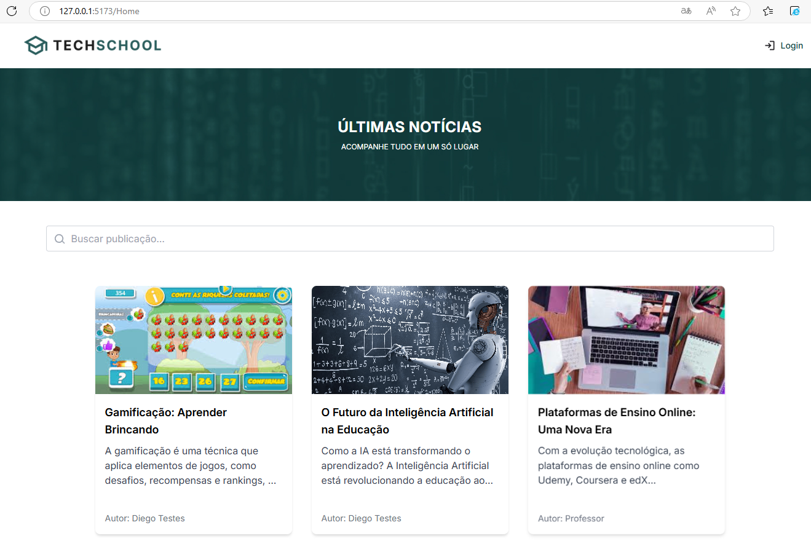
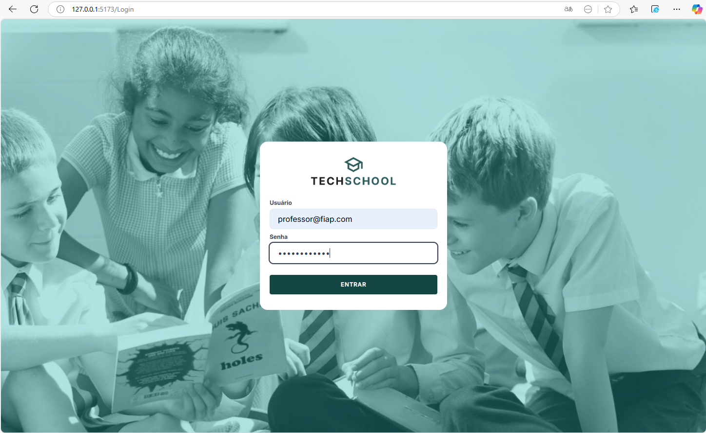
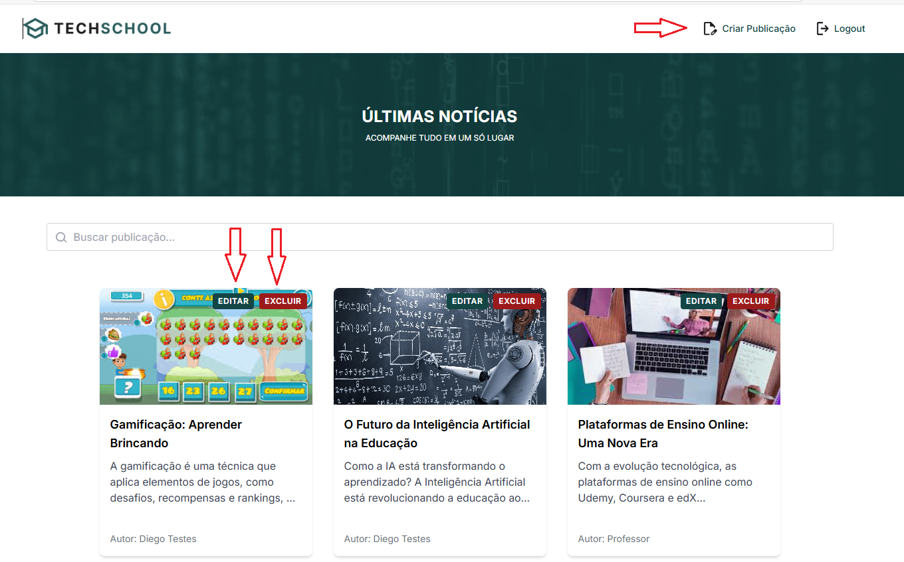
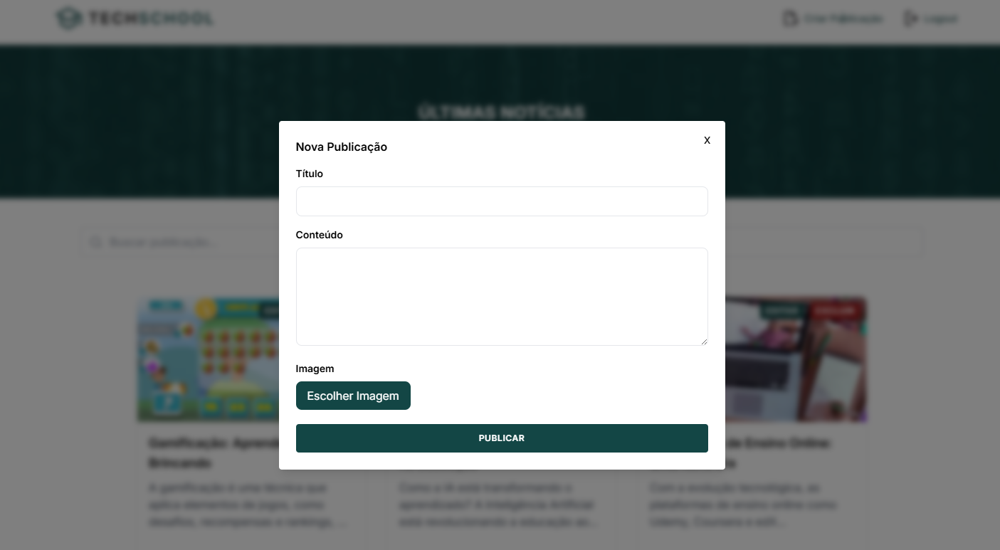
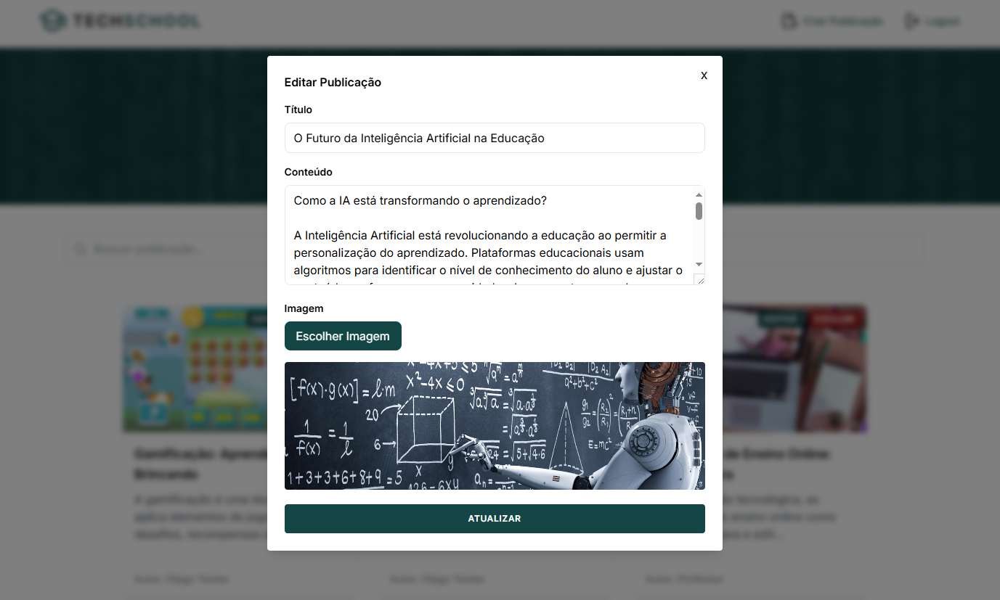
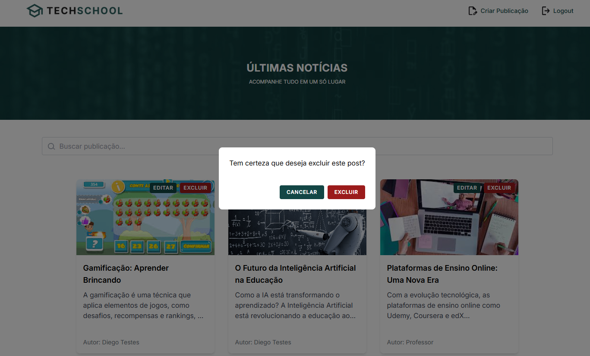

# Front-Blog-for-School

Tech Challenge Frontend is a graphical interface in React developed as an activity that integrates the knowledge acquired during the Frontend module, Phase 3 of the Post Tech FIAP Full Stack Development, Group 1, Class 2FSDT.

Members of group 1 - 2FSDT:

- RM: 357717 Cristiano Gomes da Rocha,
- RM: 357154 Diego da Silva Gervasio,
- RM: 357480 Douglas Yogi Yokomizo,
- RM: 356535 João Vitor dos Santos Correa,
- RM: 357920 Marcos Alberto Herrera Bordalo.

## Goal

The goal of this graphical interface is to provide a robust, responsive, accessible and easy-to-use blogging application, allowing faculty and students to interact and manage blog posts through post creation, editing, deletion and listing operations, using authentication login and thus facilitating content management for authors and administrators.

---

## Presentation video

[Introduction video link](https://drive.google.com/file/d/17Qe8B81myaIwwkWmZV0VruY_SG76iepM/view?usp=drive_link)

---

## Technologies used in the frontend

- React
- Axios
- Tailwind
- Tanstack
- Docker
- Vercel

---

## Application installation

This project is ready to run in a Docker environment. For this reason, only the installation of Docker will be required, and the manual installation of the project will not be necessary.

If you do not have Docker installed, follow the instructions for your operating system in the [official Docker documentation](https://docs.docker.com/get-started/get-docker/).

- use local application with Docker:

```bash
docker-compose up --build
```

---

## Test User

```bash
user: professor@fiap.com
key: password1234
```

---

## Application Screens

Screen 1: Home - Listing of Posts

- Displays a list of available posts limited to 6 posts per page,
- Allows all users to navigate to the preview pages of a post,
- Allows all users to search for a post through the search field,
- Allows the administrator to log in.



Screen 2: Login – Teacher

- Displays the form for the teacher to authenticate and manage the content.



Screen 3: Admin Page

- Displays the detailed content of a selected post,
- Provides options for creating, editing, or deleting a post for logged-in teachers only,
- Offers the option to log out for the teacher who is logged in.



Screen 4: Post Creation

- Allows the teacher to create a new post, inserting title, content, image and other relevant information.



Screen 5: Post Editing

- Allows the teacher to edit an existing post.



Screen 6: Post Deletion

- Allows the teacher to delete an existing post.



---

## Back-End Used

This repository contains the implementation of Back-End-Blogger-Fiap.

The system is in production and has been developed based on the specifications provided, using the front-end of 

The API is fully documented using Swagger. You can access the API's interactive documentation via the following link:

[API Documentation (Swagger)](https://tech-challenge-back-end.vercel.app/api-docs#/)

### Technologies used in the backend

- Language: Node.js
- Framework: Express
- Database: MongoDB
- Documentation: Swagger
- Deploy: Vercel

---

## Report of experiences and challenges

From the beginning, the group decided to version the code directly on GitHub, which allowed for an efficient organization of the project's initial structure and standards. At each step of the interface implementation, all members were notified of new Pull Requests (PRs) opened in the main branch, ensuring continuous collaboration and joint code review.

The Phase 3 classes were instrumental in the development of the project, providing the foundation we needed to move forward with confidence. Whenever doubts or obstacles arose, rewatching classes or looking for solutions on the internet made the problem-solving process more agile and effective.

In addition, the weekly group-wide meetings played a crucial role, fostering discussions and alignments that contributed to the continued progress and successful completion of the project.